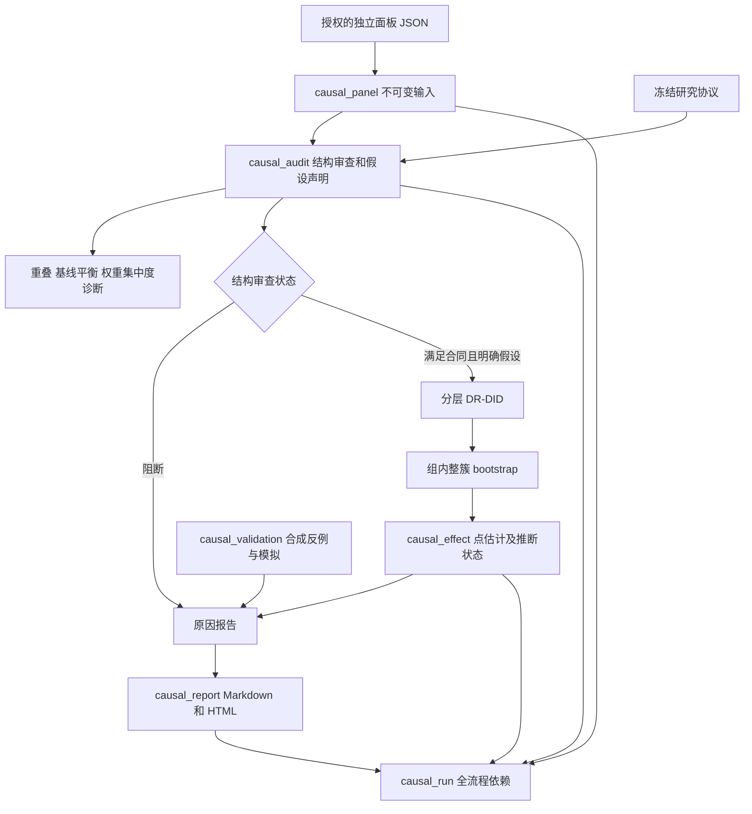

# B 模块架构与实现边界

## 目标与决策

用户提供独立学习结果、处理/对照和冻结协议后，系统生成可审查的条件效应分析；信息不足时生成具体缺口报告。核心使用确定的统计代码与可复算重抽样，不依赖大模型。AI 交互日志、AIV、独立学习结果分别管理，不能自动互相替代。

当前实现支持同一学期、共同处理起点、完整学生前后测、离散处理前分层与同处理状态的依赖簇。两学期分别运行，当前不自动合并效应。

## 数据流

`causal-run` 串联面板→审查→可选估计→报告→运行产物。诊断提示附属于审查；它们不会自动升级或降级实质识别假设。流程不自行修改用户协议，也不为获得分数而删样本、重新分箱或补造对照。

## 源码职责

|文件|职责|
|---|---|
|`challenge/causal.py`|输入合同、协议验证、识别审查、分层饱和估计、bootstrap、分层与偏差界；保留历史报告函数导入入口|
|`challenge/causal_diagnostics.py`|原量纲基线差异、固定尺度 SMD、共同支持、学生/簇 ESS 和集中度；不参与结果拟合|
|`challenge/causal_workflow.py`|单次研究流程编排、失败状态、不可变运行依赖|
|`challenge/causal_reporting.py`|审查/效应/模拟的聚合报告；HTML 转义；与估计逻辑分离|
|`challenge/causal_demo.py`|明确合成的已知效应及趋势违背数据；有限 Monte Carlo 验证|
|`challenge/__main__.py`|CLI 参数、任务回执与退出码；无网络推理调用|
|`challenge/storage.py`|内容哈希、源码指纹、依赖校验、原子写入和写者锁，复用已有实现|
|`configs/causal.protocol.template.json`|默认未核实的协议模板；示例不能冒充数据证据|
|`tests/test_causal.py`、`tests/test_causal_workbench.py`|公式、合同、阻断、诊断、完整流程和报告的行为验证|

## 合同与状态

面板合同 `causal-panel-v1` 保留一人一行及真实簇标识；协议合同 `causal-protocol-v1` 在审查产物内保存完整快照。所有后续结果通过依赖引用固定面板与协议，不根据当前磁盘上被修改的配置偷偷重算。

|流程状态|保存内容|退出码|含义|
|---|---|---:|---|
|blocked|输入、审查、原因报告、运行产物；无效应产物|2|缺少结构/声明条件，禁止估计|
|estimated_without_inference|上述内容及条件点估计；CI/p为空|0|计算完成，但推断条件不足|
|estimated_under_assumptions|条件点估计及近似区间/检验、报告、运行产物|0|数据满足所实施合同，解释仍依赖假设|
|输入格式异常/IO失败|错误回执及此前已完成的不可变阶段|按现有 CLI 合同|未完成工作流；不伪造因果结果|

研究者声明平行趋势等假设为 `assumed` 后才可估计。系统不能凭两期数据证明反事实平行，模拟特意保留“声明通过但真实假设失效”的反例。诊断显示平衡也不证明未测混淆消失。

## 可复算与披露

`causal_run` 存储产物 ID，报告文件的随机导出目录不进入内容身份；相同输入与 seed 可复用运行 ID。报告只展示汇总和预设基线分类，不输出学生/班级标识或逐条成绩。`synthetic` 从输入向后传播，合成结果始终标记为验证用途。

真实面板、协议证据、运行回执和派生结果放在忽略目录。公共源码只包含通用模板和合成样本。命令行不调用远端模型，不上传数据；真实材料也不会因运行了本模块而自动获得发布权限。

## 当前不支持

重复横截面、多期分批采用、混合处理簇、连续协变量学习、交叉拟合、缺失机制建模、ITT/工具变量、正式子组效应差异检验及跨学期自动汇总均未实现。它们需要各自的识别合同和验证，不通过放松当前检查模拟支持。

使用方法及数学口径见 [B 模块操作说明](causal-b.md)。
